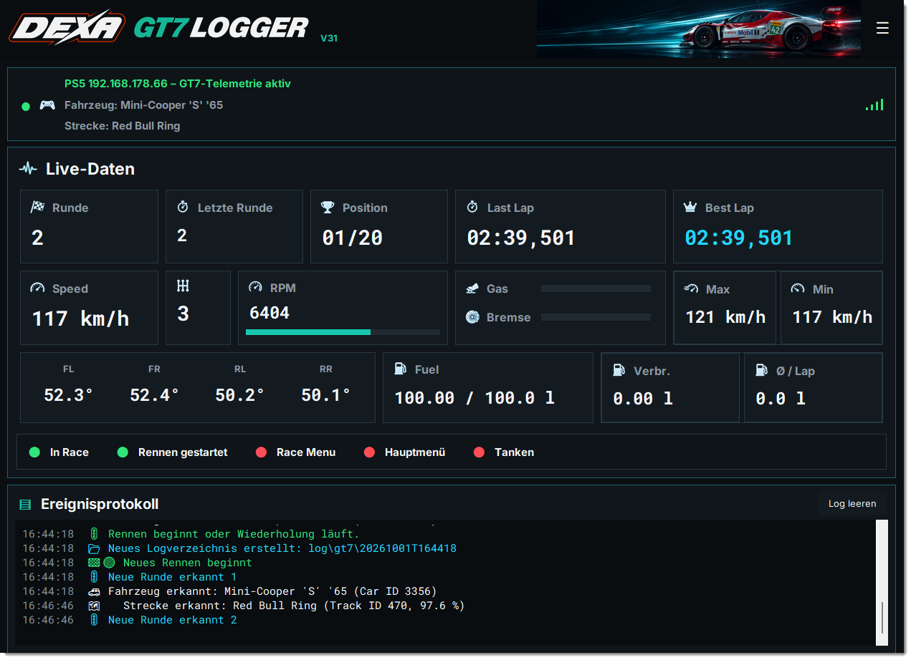
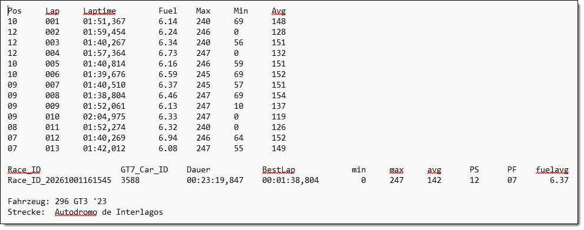
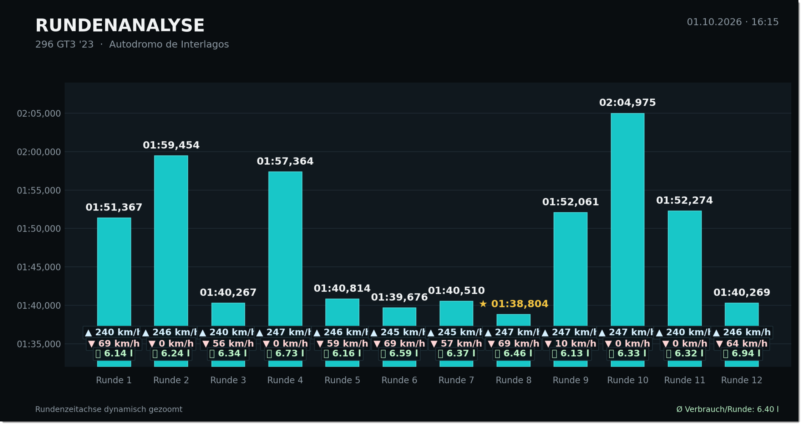

# DEXA GT7 Logger 
"Every millisecond tells a story. I just write it down."

A modern, modular telemetry logger for Gran Turismo 7 – built to precisely capture and analyze race data via the UDP protocol. It records key metrics such as lap times, fuel usage, speed, and vehicle position, and is structured for future extension.

🛠️ Sure, there are already plenty of GT7 loggers out there. But this one is mine – built around the data and summaries I actually want after a race.

I wanted a tool that delivers a reliable summary after every race – no missing laps, no pit stop chaos.
And honestly? I hadn’t touched code in over 20 years. This project was my way back – a challenge, a learning journey, and something I continue to develop step by step.

"This is my logger. There are many like it, but this one is mine."

---

##  Features

*  Reads live UDP packets from GT7 on port `33740`
*  Reliably calculates **fuel consumption**, including pit stop handling
*  Logs lap times, speed data, fuel consumption and more
*  Outputs as plain text or for further analysis in tools like Streamlit or Excel
*  Supports structured log file format
*  Tracks values like `fuel_start_of_lap`, `fuel_used`, `best_lap`, `total_time`, and other telemetry fields

---

##  Requirements

* Python 3.10 or higher
* Recommended libraries:

```bash
pip install -r requirements.txt
```

---

## ⚙️ Usage

Start GT7 on your PS5 with UDP telemetry output enabled.

Ensure your PC is on the same network.

Run the script:

```bash
python dexa-gt7-logger.py <IP address of your PlayStation> [nogfx]
```

Data will be saved as `.txt` files in the `/logs/` folder.

"Debugger? I log and pray."

---

## Sample Output

```
Pos	Lap	Laptime		Fuel	Max	Min	Avg
10	001	01:51,367	6.14	240	69	148
...
07	012	01:40,269	6.94	246	64	152
07	013	01:42,012	6.08	247	55	149
 
Race_ID                 GT7_Car_ID    Dauer           BestLap            min     max     avg      PS      PF    fuelavg
Race_ID_20261001161545  3588          00:23:19,847    00:01:38,804         0     247     142      12      07       6.37

Fahrzeug: 296 GT3 '23
Strecke:  Autodromo de Interlagos
```

---

## 📸 Preview / Screenshots

A few screenshots to illustrate what’s going on.

  






---

## ❓ Questions or Ideas?

Always open to tips on how to extract **more or different data from GT7** – whether it's hidden packet content, creative workarounds, or your own tools.
→ Open an Issue or send a PR! 😄

---

## License

MIT License – see `LICENSE`

---

## Credits

This project is based on the excellent [raw-sim-telemetry](https://github.com/GeekyDeaks/raw-sim-telemetry) by [@GeekyDeaks](https://github.com/GeekyDeaks).  
Many thanks for the original structure and for sharing the code openly!

* [Nenkai](https://github.com/Nenkai) for insights into GT7 packet structures
* [ddm999](https://github.com/ddm999) / [gt7info](https://github.com/ddm999/gt7info) for the GT7 car identification data
* [Bornhall](https://github.com/Bornhall) / [gt7telemetry](https://github.com/Bornhall/gt7telemetry) for the GT7 track detection data and `gt7trackdetect.csv`
* Gran Turismo™ – Polyphony Digital
